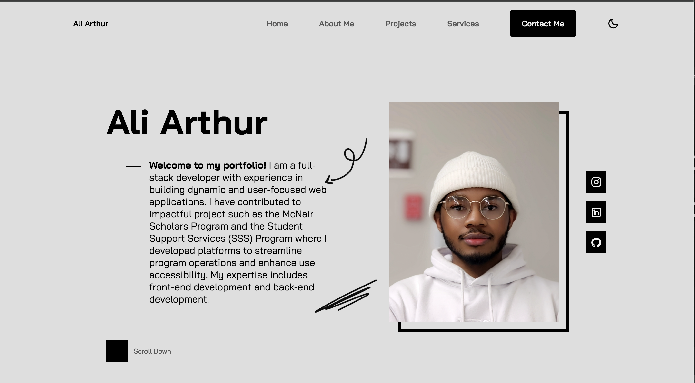
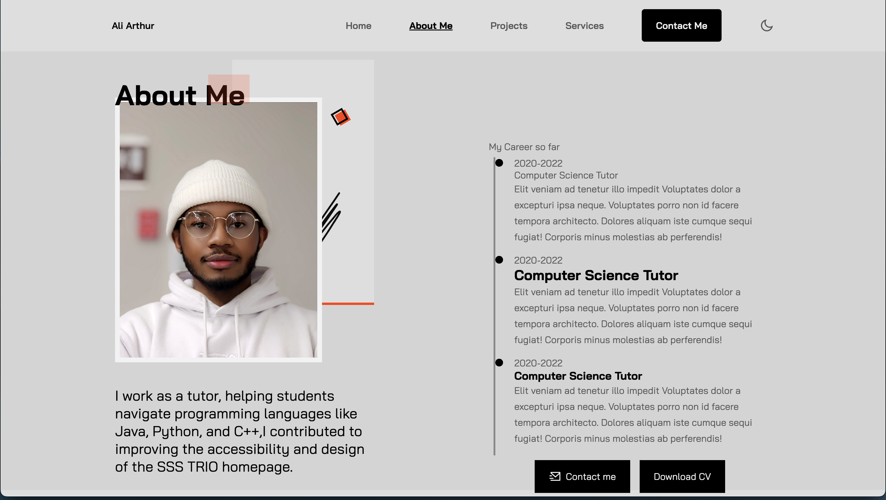
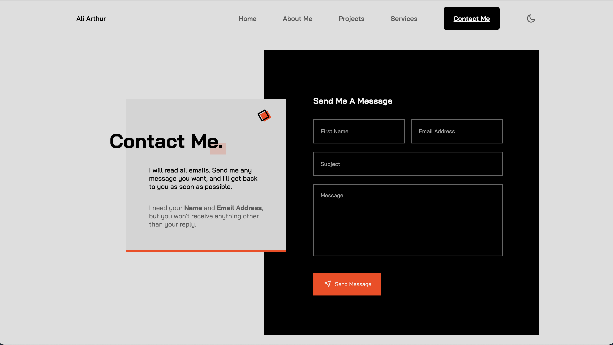
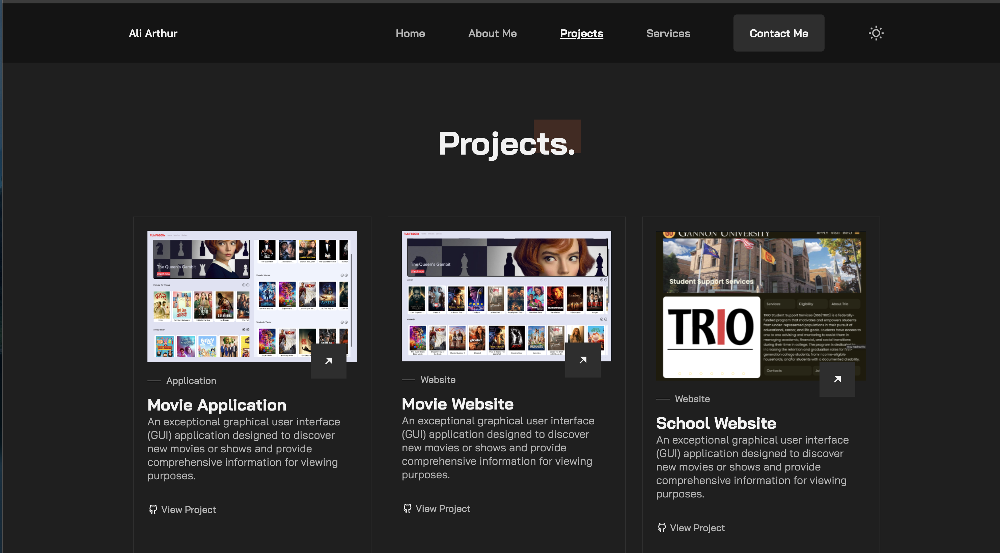

<a name="readme-top"></a>
<!-- PROJECT LOGO -->
<br />
<div align="center">

  <h3 align="center">Ali Arthur Portfolio</h3>

  <p align="center">
    A responsive and modern personal portfolio website showcasing my skills, projects, and contact information.
    <br />
    <a href="#preview">Preview</a>
    ·
    <a href="https://github.com/Savant35/portfolio/issues">Report Bug</a>
    ·
    <a href="https://github.com/Savant35/portfolio/pulls">Request Feature</a>
  </p>
</div>

<!-- TABLE OF CONTENTS -->
<details>
  <summary>Table of Contents</summary>
  <ol>
    <li>
      <a href="#about-the-project">About The Project</a>
    </li>
    <li>
      <a href="#getting-started">Getting Started</a>
      <ul>
        <li><a href="#prerequisites">Prerequisites</a></li>
        <li><a href="#installation">Installation</a></li>
        <li><a href="#preview">Preview</a></li>
      </ul>
    </li>
    <li><a href="#preview">Demo</a></li>
    <li><a href="#license">License</a></li>
  </ol>
</details>

<!-- ABOUT THE PROJECT -->
## About The Project
This is a personal portfolio website built with HTML, CSS, and JavaScript. It presents my background, skills, services, featured projects, and includes a contact form so visitors can get in touch.

<p align="right">(<a href="#readme-top">back to top</a>)</p>

<!-- GETTING STARTED -->
## Getting Started

### Prerequisites
* A modern web browser
* HTML/CSS
* JS
<p align="right">(<a href="#readme-top">back to top</a>)</p>

### Installation
```sh
$ git clone https://github.com/Savant35/portfolio.git
$ cd portfolio
$ open index.html
```

## Preview
<div align="center">
  <table>
    <tr>
      <td></td>
      <td></td>
    </tr>
    <tr>
      <td></td>
      <td></td>
    </tr>
  </table>
</div>

<!-- LICENSE -->
## License

Distributed under the MIT License.

<p align="right">(<a href="#readme-top">back to top</a>)</p>
